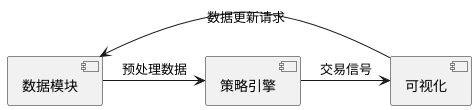
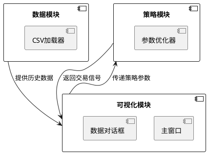

# 量化回测系统开发日志

## 框架设计（2023-10-20）
- 完成模块化架构设计
- 确定数据流：CSV加载 → 预处理 → 策略引擎 → 可视化

## 模块说明


## 变更记录
| 日期       | 修改内容          | 负责人 |
|------------|-------------------|--------|
| 2023-10-20 | 初始化项目结构     | 开发者 |

## 自动化流程

### 操作指引
```bash
# 安装预提交钩子
ln -s ../../utils/git_hooks/pre-commit .git/hooks/
```

### 脚本实现
```python:/utils/auto_logger.py
from datetime import datetime
import subprocess

class ChangeLogger:
    MARKER = '<!-- AUTO-LOG -->'

    def __init__(self, log_file='开发记录.md'):
        self.log_file = log_file

    def append_entry(self, change_type, description):
        timestamp = datetime.now().strftime('%Y-%m-%d %H:%M')
        entry = f'- {timestamp} [{change_type}] {description}\n'
        
        # 获取当前Git短哈希
        commit_hash = subprocess.check_output(
            ['git', 'rev-parse', '--short', 'HEAD']
        ).decode().strip()
        
        with open(self.log_file, 'r+') as f:
            content = f.read()
            if self.MARKER in content:
                new_content = content.replace(
                    self.MARKER,
                    f'{entry}{self.MARKER}'
                )
                f.seek(0)
                f.write(new_content)
```
```python:/utils/auto_logger.py
# 开发记录自动化脚本框架
class ChangeLogger:
    def append_entry(self, change_type, description):
        """自动格式化时间戳和变更记录"""
        timestamp = datetime.now().strftime('%Y-%m-%d %H:%M')
        
## 待解决问题

### 当前版本待完善功能
1. 数据加载对话框预览表格未绑定数据解析逻辑
2. 主窗口控制面板缺少策略参数输入组件
3. K线图模块尚未集成绘图引擎

---

## 自动化开发日志
<!-- AUTO-LOG -->


### 记录规范
1. 每次功能提交后自动追加记录
2. 修改影响范围标注模块前缀：
   - [UI] 界面相关
   - [DATA] 数据处理
   - [STRAT] 策略逻辑

## 版本变更日志
### 2024-02-20 v1.0.0-alpha
- [UI] 主窗口布局系统
- [UI] 数据加载对话框原型
- [CORE] PyQt5应用程序启动器

### 2024-02-20 v1.0.0-alpha
- 完成基础界面框架搭建
  - 主窗口布局系统
  - 数据加载对话框原型
- 实现PyQt5应用程序启动器
- 建立模块化开发文档体系

## 模块交互关系


## 待解决问题
1. K线图实时刷新性能优化
2. 多策略并行回测实现方案